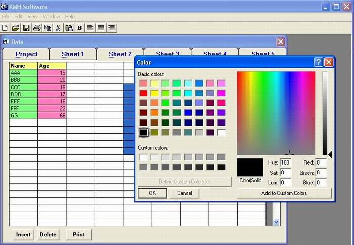



## Excel Program\-Msflexgrid Preview \(ver\. 4\)

### Description

I think This code is the best code for me,It is something like Excel Application,you can Print/Save/Open change the color of cell and writing and also the font.

I have spend alot of time in this project to put many Functions of Excel Sheet and i hope it admire you.

If my Code admire you,please Vote me,this will Support me much.Thanks alot for your Help and advice.
 
### More Info
 

             |
---                |---
**Submitted On**   |2004-09-19 20:42:30
**By**             |[Khaled Agwa](https://github.com/Planet-Source-Code/PSCIndex/blob/master/ByAuthor/khaled-agwa.md)
**Level**          |Advanced
**User Rating**    |4.9 (300 globes from 61 users)
**Compatibility**  |VB 5\.0, VB 6\.0
**Category**       |[Complete Applications](https://github.com/Planet-Source-Code/PSCIndex/blob/master/ByCategory/complete-applications__1-27.md)
**World**          |[Visual Basic](https://github.com/Planet-Source-Code/PSCIndex/blob/master/ByWorld/visual-basic.md)
**Archive File**   |[Excel\_Prog1797579262004\.zip](https://github.com/Planet-Source-Code/khaled-agwa-excel-program-msflexgrid-preview-ver-4__1-55946/archive/master.zip)

